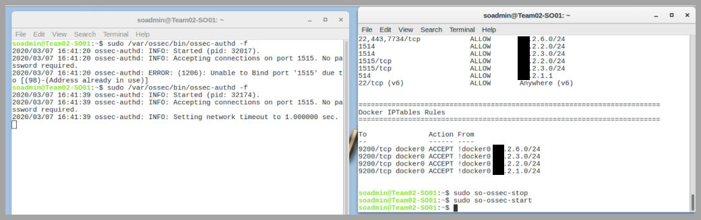
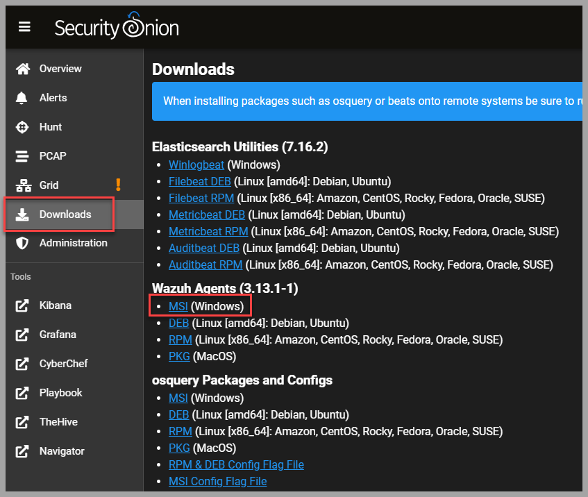
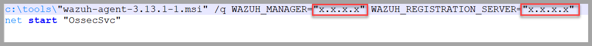
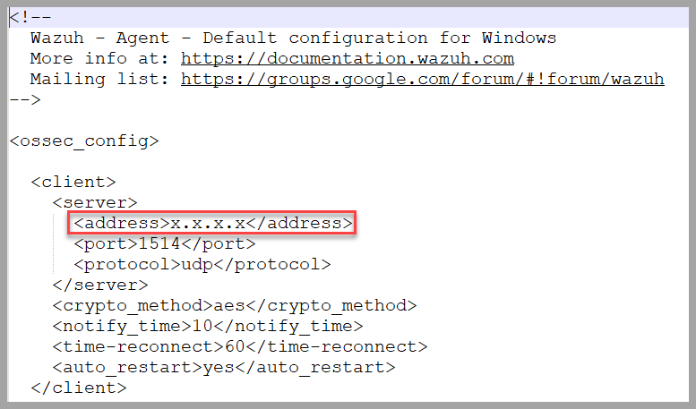
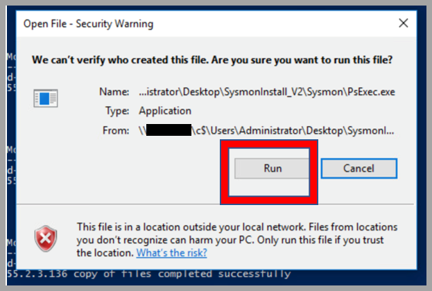

# 4.08 Deploy or Evaluate Host Sensors

## Task 
Deploy or Evaluate Host Sensors (Prepare Security Onion to listen for Wazuh agents on the network)

---

## Conditions
Given access to a network and the ability to install and configure Security Onion.

---

## Standards

* Prepare Security Onion to listen for and receive Sysmon logs through deployed Wazuh agents.
* Configure Wazuh agents to forward local Sysmon logs on compromised hosts to Security Onion NIDS.
* Validate connectivity and log ingestion from all deployed Wazuh agents.

---

## End State

Hosts on the compromised network utilize Wazuh to forward Sysmon and event logs to Security Onion NIDS for parsing in Kibana.

---

## Notes

- Always validate that logs are being ingested after configuration.
- Ensure system clocks on hosts and Security Onion are synchronized to avoid log correlation issues.
- Use the correct version of Wazuh agent compatible with the Security Onion deployment version.

---

## Manual Steps

### Set Up

* **Security Onion Host (Linux - NIDS)**: This is the Security Onion box that we bring to the environment.
* **Windows Workstations**: These are the client hosts at the incident site which will be monitored.

---

### Configure Security Onion to Receive Logs

On the Security Onion system, log into the local system. Open **two Terminal windows**, further referred to as **Terminal A and Terminal B**.

#### Terminal A: Stop Wazuh temporarily

```bash
sudo so-wazuh-stop
```

#### Terminal B: Run ossec-authd to listen for agent connections

```bash
sudo /var/ossec/bin/ossec-authd -f
```

#### Terminal A: Restart Wazuh service after enabling agent authentication

```bash
sudo so-wazuh-start
```



> **Operator Note:** ossec-authd running in foreground allows new agents to authenticate and register.

---

### Install Software on Windows Hosts

* The repository comes with all necessary files for deployment, but it is preferable to download the Wazuh agent directly from the currently deployed Security Onion system during the mission to ensure compatibility.
* Login to Security Onion, select **Downloads** from the menu on the left, and download the Wazuh agent for Windows. 
* Once downloaded, right-click the installer → select **Properties** → check `Unblock` and apply the changes.



---

### Modify Configuration Files on Windows Host

#### Edit `install-sysmon.bat`

- Update the IP address inside this batch file to reflect your deployed Security Onion's IP address.



#### Edit `ossec.conf`

- Update the `<server>` section in `ossec.conf` with the Security Onion sensor's IP address.



> **Operator Note:** Ensuring proper IP addressing here is critical for logs to reach Security Onion.

---

### Running PowerShell Script on Windows Hosts

* Execute the PowerShell deployment script:

```powershell
scripts\Software_Push.ps1
```

* Input domain credentials and install parameters when prompted:
  * **User:** Administrator@domain.name
  * **IP Address:** The IP address of the system running the script.
  * **Domain Admin Password:** Enter domain admin credentials.
  * **Domain:** The AD domain name.

* Click `Run` to allow PsExec to execute and deploy Sysmon and Wazuh agent to target host(s).



> **Operator Note:** Ensure PsExec is not blocked by local AV or endpoint protections. You may need to whitelist or run from administrative CMD or PowerShell with proper execution policies enabled.

---

### Listing Wazuh Agents (Validation)

After deployment, return to Security Onion to verify agents are reporting properly:

```bash
so-wazuh-agent-manage
```

- Ensure all deployed agents appear in the list.
- Check agent status (should be active/connected).
- Validate log ingestion in Kibana or via log file review.

> **Operator Note:** Any agents not reporting may need to be reconfigured or network connectivity validated (firewall, DNS resolution).

---

## Dependencies

* Security Onion NIDS properly installed and configured.
* Privileged access to target hosts on network.
* Properly staged install packages for Wazuh and Sysmon.
* Domain admin or equivalent credentials for host deployment.
* PsExec or PowerShell Remoting enabled on target hosts.

---

## Other Available Tools

* OSSEC (as a lightweight alternative to Wazuh if necessary)
* Velociraptor (for more advanced host telemetry and collection)
* Winlogbeat (to forward Windows event logs directly to ELK/Security Onion if needed)

---

## Operator Recommendations and Additional Tools

### Operator Checklist

- [ ] Verify Security Onion is configured to accept new Wazuh agents.
- [ ] Download Wazuh agent from Security Onion Downloads page.
- [ ] Unblock and prepare agent installer on each host.
- [ ] Edit `install-sysmon.bat` and `ossec.conf` with correct IP addressing.
- [ ] Run `Software_Push.ps1` to deploy Sysmon and Wazuh agent.
- [ ] Confirm agent connection and log ingestion via `so-wazuh-agent-manage`.
- [ ] Validate event logs and Sysmon data are viewable in Kibana or Elastic.

### Best Practices

- Prefer agent download from deployed Security Onion → ensures compatibility.
- Validate log ingestion before moving on → missing logs = reduced visibility.
- Deploy during low-use hours when possible → reduces impact on production systems.
- Maintain version control of scripts and configs → easier troubleshooting later.

---

## References

[Installing Wazuh](https://documentation.wazuh.com/3.7/installation-guide/installing-wazuh-agent/index.html)  
[Wazuh (Security Onion)](https://securityonion.readthedocs.io/en/latest/wazuh.html)

---

## Revision History

| Date | Version | Description | Author |
|------|---------|-------------|--------|
| 2025-05-02 | 1.0 | Fully corrected and expanded version preserving original + expanded operator guidance with screenshots | Leo |
