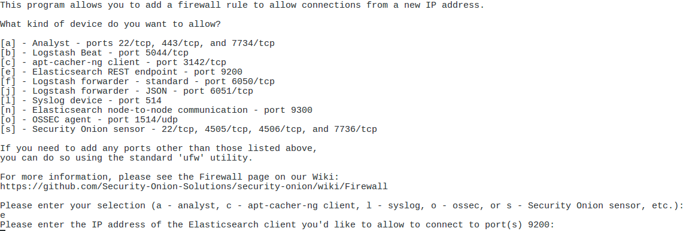

# 4.09 Install and Deploy Security Onion

## Task

Install and Deploy Security Onion

---

## Conditions

Given a Linux Security Onion machine.

---

## Standards

* Configuring Security Onion (SO) from an instantiated virtual machine.
* Setup Security Onion firewall rules.
* Connecting to Security Onion from another box for log visibility and analyst access.

---

## End State

Fully functioning Security Onion NIDS receiving and parsing logs from target network segments.

---

## Manual Steps

### Configuring Security Onion from an instantiated virtual machine

* Login to SO.
> **Note:** for lab/range use credentials from SharePoint.

* Open Terminal → Click `Applications` → `Utilities` → `Terminal`. Leave terminal off to the side.

* Launch setup → Double click setup icon on desktop.
> **Note:** Use password from Step 1.1 in setup.

* Select `Yes, Continue!`

* Select `Yes, configure /etc/...`

* Select the management interface:
  * In Terminal type `ip address`
  * Verify the interface IPv4 address matches what is selected.

* Set a static IP → Make sure static is selected → Select `Ok`.

* Input IPv4 address → select `Ok` → refer to Terminal output.

* Input your subnet CIDR → select `Ok`.

* Input your gateway:
```bash
ip route
```
* Use IP after `default via` for gateway.

* Input your DNS → In Terminal:
```bash
nslookup google.com
```
* Use displayed DNS servers.

* Input your domain name:
```bash
hostname -f
```
* Input everything after first period → select `Ok`.

* Configure sniffing interfaces → select `Yes, configure...`

* Ensure management interface is NOT selected → select `Ok`.

* Select `Yes, make changes!`

* Select `Yes, Reboot!`

* Login to SO again → Use original credentials.

* Launch setup again → double click setup icon.

* Input system logon password.

* Select `Yes, Continue` to configure services.

* Select `Yes, skip...` to skip prior config.

* Select `Production Mode`.

* Select `New` deployment.

* Input first user account (not default) → set password twice.

* Select `Best Practices`.

* Select `Emerging Threats Open` ruleset.

* Select `Snort` IDS engine.

* Select `Enable our sensors`.

* Accept default port configurations → Select `Ok`.

* Review monitoring interfaces → confirm management interface NOT selected → Select `Ok`.

* Define HOME_NET subnets → Input each subnet in CIDR → comma separated.

* Store logs locally → Select `Yes`.

* Accept default log size → Select `Ok`.

* Finish configuration → Select `Yes, proceed...`

* Confirm and accept defaults until complete → Select `Ok` six times.

---

### Setup Security Onion Firewall Rules (so-allow)

After initial setup, configure local firewall to permit necessary communications.

* Open Terminal:
```bash
sudo so-allow
```

#### Allow analyst access
> Allows workstations or ranges to access SO web interfaces.
```bash
sudo so-allow
```


#### Allow Elasticsearch access
> Allows other SO boxes or apps to connect to Elasticsearch.
```bash
sudo so-allow
```


#### Allow PAN syslog device
> Allows Palo Alto to forward logs to SO.
```bash
sudo so-allow
```


#### Allow Wazuh/OSSEC agent connectivity
> Allows workstations/servers running Wazuh agent to report into SO.
```bash
sudo so-allow
```


> **Operator Note:** Always validate and limit scope → use DAPE (Deny All, Permit by Exception) logic.

---

### Connecting to Security Onion from Another Box

* On analyst laptop:
  * Open web browser.
  * Enter IP of Security Onion management interface.

* If connection fails:
  * Validate analyst workstation is in same subnet.
  * Check firewall rules:
```bash
sudo ufw status numbered
sudo ufw delete <rule_number>
```

* Once connected → Open Kibana from web interface.
* Login using credentials created in step 1.15.

> **Operator Note:** This step validates operational readiness → Kibana access confirms sensors and ingestion are online.

---

## Dependencies

* Security Onion virtual machine.
* Network access and static IP configuration.
* Proper subnet and CIDR information.
* Access to Security Onion and analyst workstations.

---

## Other Available Tools

| Tool | Platform | Installation | Usage |
|------|----------|--------------|-------|
| so-allow | Security Onion | Built-in | Configures firewall access rules |
| Kibana | Web UI | Built-in | Visualize and search logs |
| ElasticSearch | Backend | Built-in | Stores log data |

---

## Operator Recommendations and Additional Tools

### Operator Checklist

- [ ] Install and configure Security Onion from virtual machine.
- [ ] Assign static IP, gateway, subnet, DNS, and domain during setup.
- [ ] Complete production mode configuration and sensor setup.
- [ ] Configure firewall rules via `so-allow` for analyst, PAN, Wazuh, and OSSEC agents.
- [ ] Validate remote analyst access to SO web interface.
- [ ] Verify Kibana log visibility for HOME_NET.

### Best Practices

- Use `so-allow` cautiously → opening too much access weakens NIDS.
- Verify all subnets and IP ranges carefully → especially HOME_NET.
- Regularly test Kibana and sensor ingestion after deployment.
- Create snapshot or backup after successful install for quick redeployment.

---

## References

[Security Onion Docs](https://securityonion.readthedocs.io/en/latest/)  
[Security Onion Docs - Local](/ReferenceDocuments/docs-securityonion-net-en-2.3.pdf)  
[Security Onion Walkthrough](https://github.com/Security-Onion-Solutions/securityonion/wiki/IntroductionWalkthrough)

---

## Revision History

| Date | Version | Description | Author |
|------|---------|-------------|--------|
| 2025-05-02 | 1.0 | Final corrected version preserving original + expanded operator instructions, validation, and context | Leo |
