# PAN Forward Syslog to Security Onion

## Task

Configure Palo Alto Networking Device to forward all alerts and logs to Security Onion Syslog server for ingestion and analysis.

---

## Conditions

Given a Palo Alto Networking device and Security Onion / Syslog server.

---

## Standards

* Team member validates that Palo Alto device is properly receiving and processing network traffic.
* Team member configures log forwarding to Security Onion correctly and confirms log flow.
* Security Onion receives logs and they are parsed and visible in Kibana.

---

## End State

Logs from PAN firewall are forwarded to Security Onion, parsed by NIDS and available for analysis and alerting.

---

## Notes

- Syslog forwarding uses UDP or TCP → UDP may drop packets but is simple, TCP more reliable but heavier.
- Source interface and addresses are critical → must be in same subnet as Syslog/Security Onion server.
- Security Profile Groups enforce logging rules across different threat categories → misconfiguration here can result in lost telemetry.

---

## Manual Steps

### Step 1: Access Palo Alto WebUI

* Login to Palo Alto WebUI  
* Username: Admin  
* Password: Obtain from network owner  

### Step 2: Configure Syslog Service Route

* Navigate to Device → Setup → Services → Service Route Configuration
* Customize routes
* Change Syslog source interface and IP to match subnet of Syslog/Security Onion server

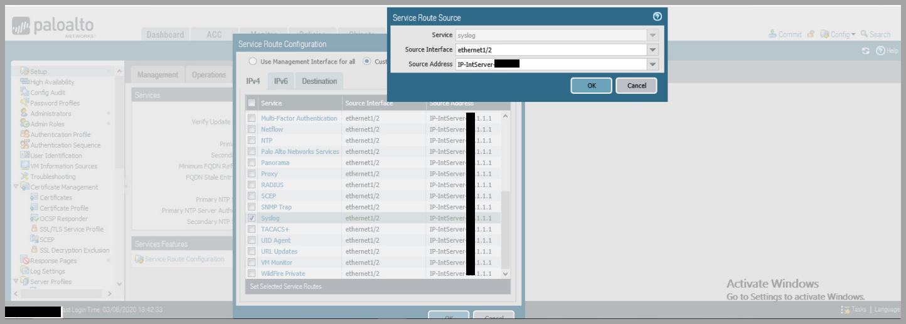

---

### Step 3: Create Syslog Server Profile

* Navigate to Device → Server Profiles → Syslog
* Click Add → name profile
* Add server → enter IP of Security Onion
* Select Transport (UDP or TCP based on network design)
* Default port: 514

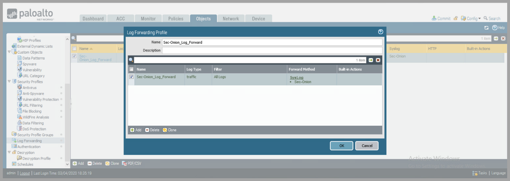

> **Operator Note:** Use TCP where reliable delivery is mandatory.

---

### Step 4: Create Security Profiles

#### Antivirus

* Create Antivirus profile
* Change Actions and Wildfire Actions → Alert

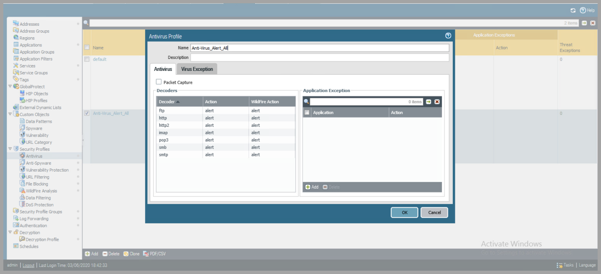

#### Anti-Spyware

* Create Anti-Spyware profile
* Change Actions → Alert

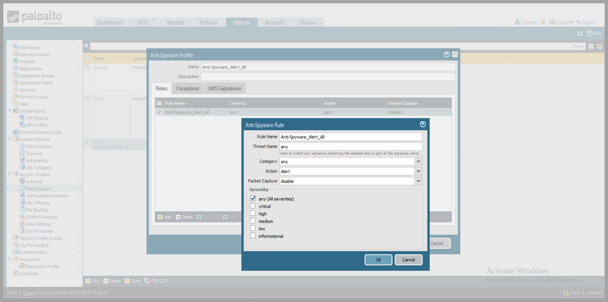

#### DNS Signatures

* Change Action on DNS Queries → Alert

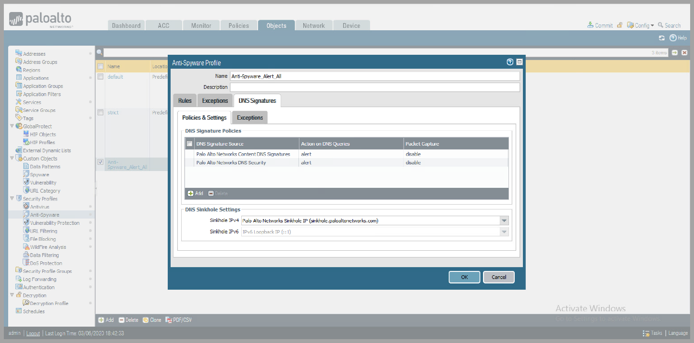

#### Vulnerability Protection

* Add Rule → Change Action → Alert

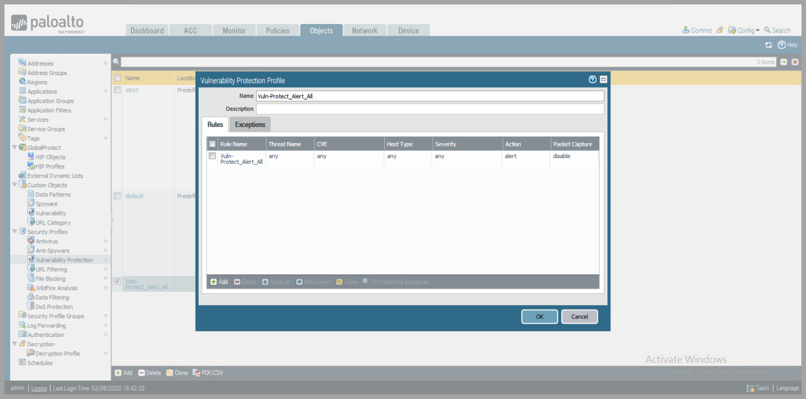

#### URL Filtering

* Add Profile → set Site Access + User Credential Submission → Alert

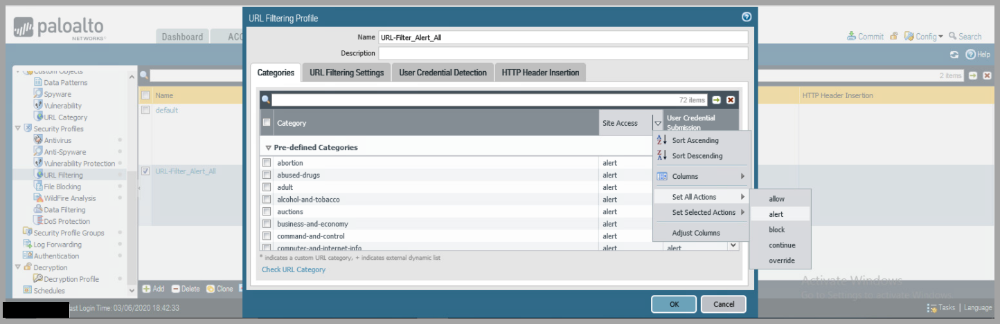
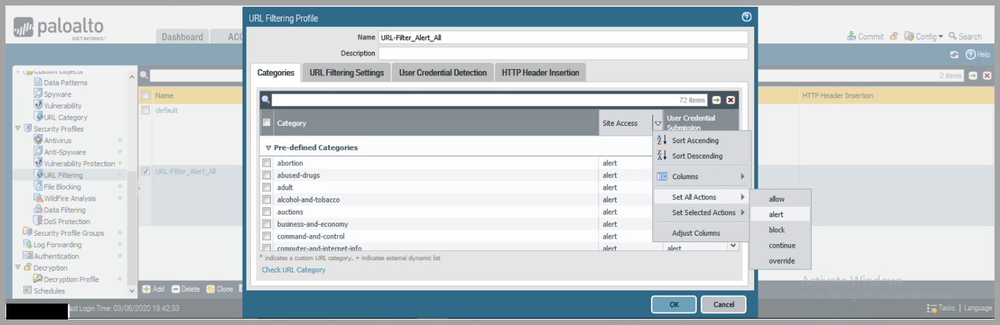

#### File Blocking

* Add Rule → Action → Alert

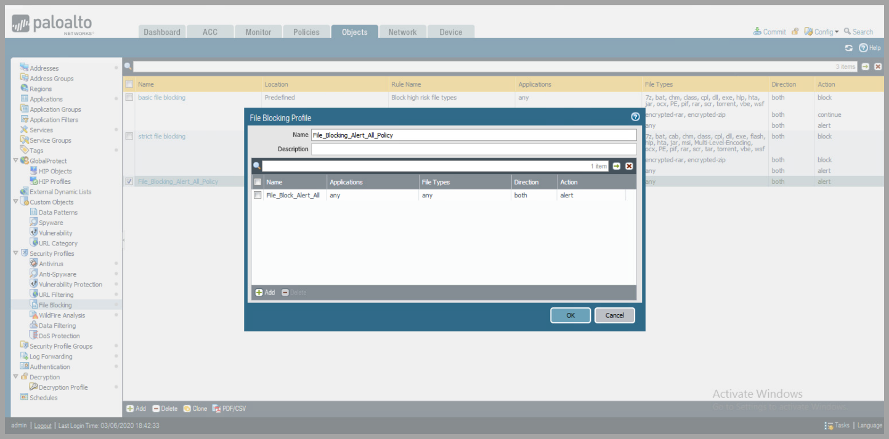

---

### Step 5: Create Security Profile Group

* Combine all profiles → new Profile Group

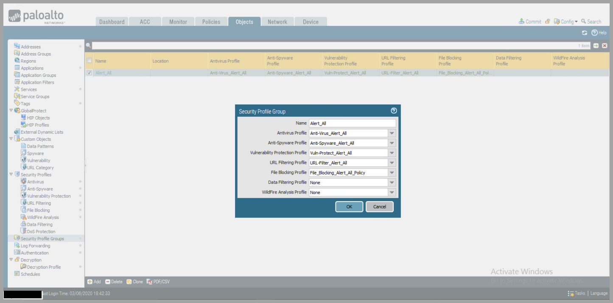
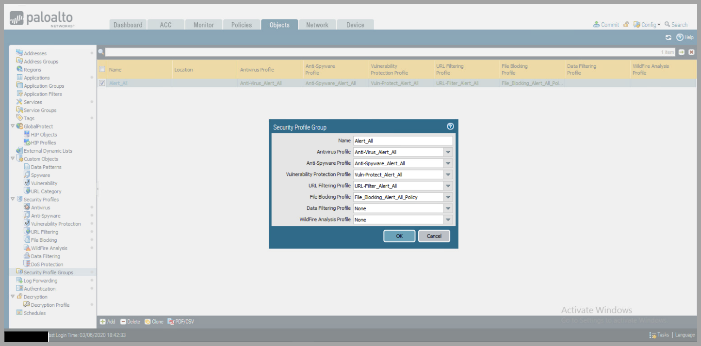

---

### Step 6: Create Log Forwarding Profile

* Navigate → Objects → Log Forwarding
* Click Add → create profile
* Add → under Syslog → select created Syslog Server Profile

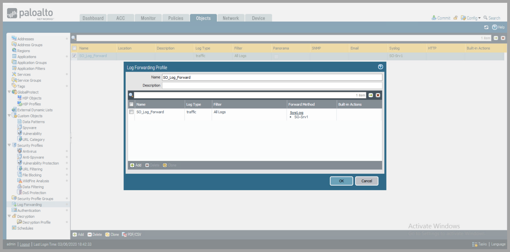
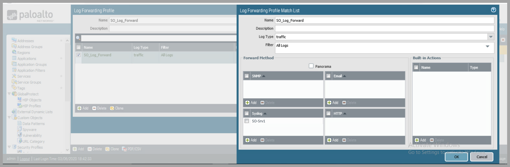

---

### Step 7: Apply Security Profiles to Security Policy

* Navigate → Policies → Security → Edit active policy
* Actions → Profile Type → Group → select created Profile Group
* Log Settings → Log at Session Start + End → select Log Forwarding Profile

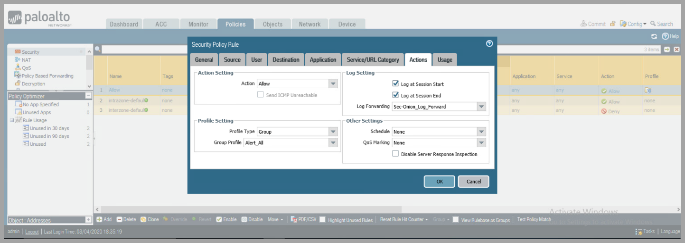

---

### Step 8: Configure Log Settings for System/Configuration Events

* Navigate → Device → Log Settings
* For each type (System, Configuration, User-ID, HIP Match, IP-Tag) → Add + select Syslog Profile

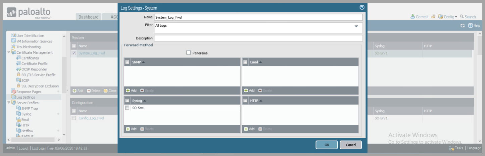
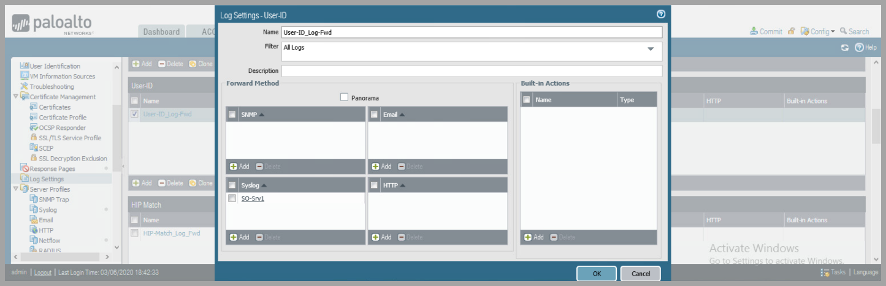
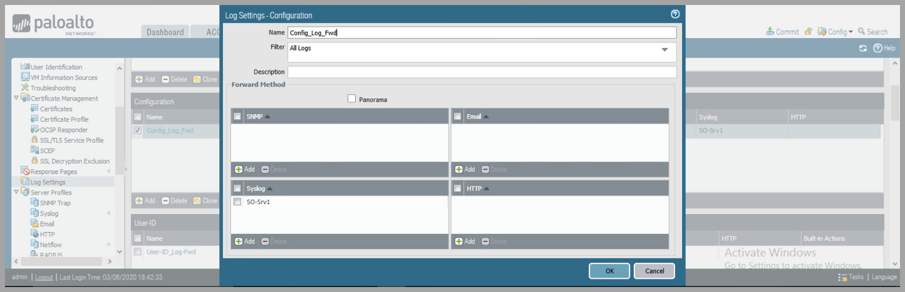
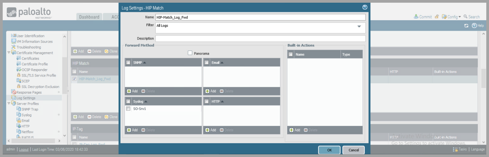
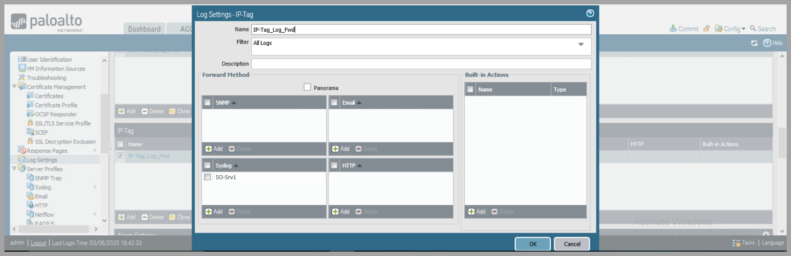

---

### Step 9: Commit Changes

* Commit all changes and add description of work performed

> **Operator Note:** Always add change description → assists during audit or troubleshooting.

---

### Step 10: Validate Logging

* On Security Onion → check /var/log/syslog or Kibana
* Confirm logs are flowing and correctly parsed
* Generate test traffic if necessary (malicious domain block, AV detection)

---

## Dependencies

* Palo Alto Firewall with admin access
* Security Onion Syslog Receiver (configured to receive on port 514)

---

## Other Available Tools

| Tool | Platform | Installation | Usage |
|------|----------|--------------|-------|
| Wireshark | Cross-platform | Package manager | Validate syslog traffic arriving |

---

## Operator Recommendations and Additional Tools

### Operator Checklist

- [ ] Validate PAN interfaces and routing (service route properly configured).
- [ ] Validate Syslog Server Profile configured with correct IP and port.
- [ ] Confirm Security Profiles configured → all alert actions selected.
- [ ] Apply Profile Group and Log Forwarding to active policies.
- [ ] Validate log receipt at Security Onion → real events are visible.

### Best Practices

- Use TCP where reliable delivery is important.
- Alerting-only profile avoids blocking during incident response.
- Use profile groups for consistent application across rules.
- Validate logs using end-to-end test → not just UI config.

---

## References

[PAN OS 9.0 Admin Guide](https://docs.paloaltonetworks.com/pan-os/9-0/pan-os-admin/monitoring/use-syslog-for-monitoring/configure-syslog-monitoring.html)  
[PAN Syslog Setup KB](https://knowledgebase.paloaltonetworks.com/KCSArticleDetailid=kA10g000000ClSlCAK)

---

## Revision History

| Date | Version | Description | Author |
|------|---------|-------------|--------|
| 2025-05-02 | 1.0 | Corrected and expanded version preserving original + operator guidance | Leo |
